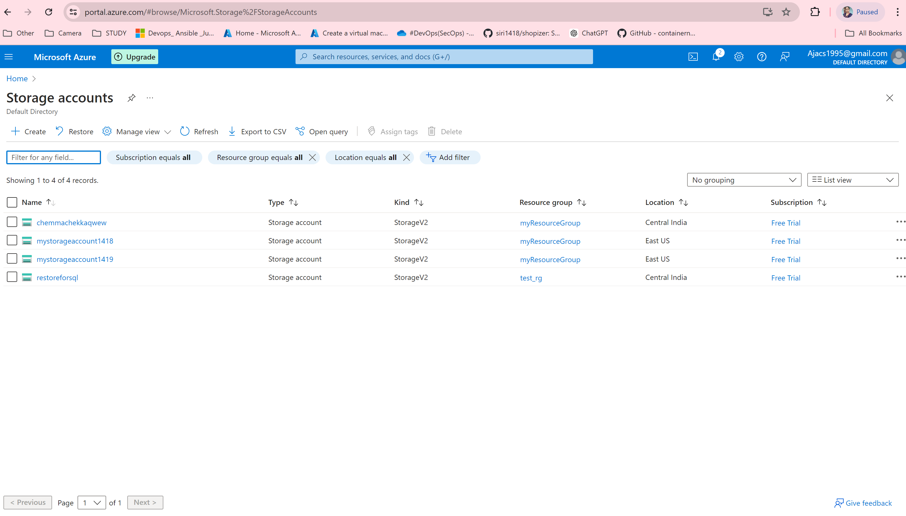
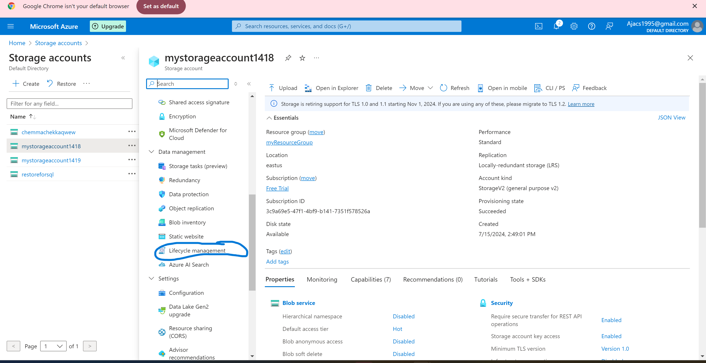

# Setting up Azure Blob Storage Lifecycle Policies
## 1. Access Azure Portal
Log in to the Azure Portal using your Azure account credentials.
## 2.Create a Storage Account:

## 2.Navigate to Storage Account
### Navigate to Lifecycle Management in Storage Account
1.Access Your Storage Account:

* Once the storage account is created, navigate to it by clicking on Resource groups in the left-hand menu, then select your resource group, and finally click on your storage account name.

2.Configure Lifecycle Management:

* In your Storage Account overview, find and click on Lifecycle management under the Blob service section.


## 3.Define Lifecycle Management Rules
 
 * Create a JSON file (policy.json) to define your lifecycle management rules. Below is an example JSON script that transitions blobs to Cool tier after 30 days and deletes blobs after 365 days
 
 ```
 {
  "rules": [
    {
      "name": "Transition to Cool after 30 days",
      "enabled": true,
      "filters": {
        "blobTypes": [ "blockBlob" ],
        "prefixMatch": [ "" ],  // Apply to all blobs
        "blobAgeDaysGreaterThan": 30
      },
      "actions": {
        "baseBlob": {
          "tierToCool": {}
        }
      }
    },
    {
      "name": "Delete after 365 days",
      "enabled": true,
      "filters": {
        "blobTypes": [ "blockBlob" ],
        "prefixMatch": [ "" ],  // Apply to all blobs
        "blobAgeDaysGreaterThan": 365
      },
      "actions": {
        "baseBlob": {
          "delete": {}
        }
      }
    }
  ]
}
```

* ### Transition Rule (30 days):
  * Name :"Transition to Cool after 30 days"
  *  Filters:"Transition blobs of type blockBlob that are older than 30 days."
  *  Action: Move blobs to Cool tier.

* ### Delete Rule (365 days):
  * Name: "Delete after 365 days"
  * Filters: Delete blobs of type blockBlob that are older than 365 days.
  
  Adjust the prefixMatch values if you want to apply these rules only to specific prefixes within your blob containers.

* ### Review and Verify
  * After applying the policy, review the settings in the Azure portal or using Azure CLI commands to ensure the lifecycle management rules are correctly configured and applied to your storage account.

* ###  Monitoring
  * Monitor the application of lifecycle management rules through Azure's monitoring and logging capabilities to ensure they are functioning as expected.


